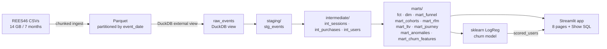

# Cohort Compass

> End-to-end retention & LTV analytics platform on **411M real e-commerce events** — SQL-first architecture (dbt + DuckDB) with an interactive Streamlit explorer that exposes every chart's underlying SQL.

[](https://github.com/heorhiidzhyncharadze/cohort-compass/actions/workflows/ci.yml)
[](https://heorhiidzhyncharadze.github.io/cohort-compass)


**[🚀 Live Demo](https://cohort-compass.streamlit.app)** &nbsp;|&nbsp; **[📊 dbt Docs](https://heorhiidzhyncharadze.github.io/cohort-compass)**

---

## What is this?

Most junior analytics portfolios are a Jupyter notebook on Olist or Titanic. Cohort Compass is different:

- **Real scale** — 411M events from a live e-commerce store (REES46, Oct 2019–Apr 2020)
- **SQL-first** — every transformation lives in dbt; every chart exposes its SQL via a "Show SQL" toggle
- **Full pipeline** — raw CSV → chunked Parquet ingest → dbt staging/intermediate/marts → Streamlit app → sklearn churn model
- **0$ infra** — DuckDB runs locally as a single file; deploy on Streamlit Community Cloud with sampled data

---

## Screenshots

<!-- TODO Day 14: add 6 screenshots -->
*Screenshots coming after app is complete.*

---

## Architecture

```
CSV (14 GB) ──► scripts/ingest.py ──► Parquet (partitioned by event_date)
                                               │
                                    DuckDB  (warehouse/)
                                               │
                         dbt-duckdb: staging ──► intermediate ──► marts
                                               │
                    Streamlit app (8 pages)    │    sklearn churn model
                    + "Show SQL" toggle        │    (reads mart_churn_features)
```



---

## Tech Stack

| Layer | Tool |
|---|---|
| Ingest | Python (chunked CSV → Parquet via pandas + pyarrow) |
| Storage | DuckDB 1.x (single `.duckdb` file, OLAP) |
| Transformation | dbt-core 1.8 + dbt-duckdb adapter |
| Orchestration | Makefile |
| Presentation | Streamlit 1.38 (multipage) + Plotly |
| ML | scikit-learn (LogisticRegression, AUC 0.63 — honest model, no leakage) |
| Deps | uv + pyproject.toml |
| CI | GitHub Actions (pytest + dbt parse on every push) |
| Docs | dbt docs → GitHub Pages |
| Deploy | Streamlit Community Cloud (sampled 10% users) |

---

## SQL Highlights

The dbt layer contains 12+ models showcasing advanced SQL:

| Technique | Model | SQL Pattern |
|---|---|---|
| Sessionization | `int_sessions` | `SUM(CASE WHEN gap > 30min THEN 1 ELSE 0 END) OVER (PARTITION BY user_id ORDER BY event_time)` |
| Cohort retention | `mart_cohorts` | `DATE_TRUNC('month', first_purchase)` + `PIVOT` |
| RFM scoring | `mart_rfm` | `NTILE(5) OVER (ORDER BY recency/frequency/monetary)` |
| Funnel | `mart_funnel` | Conditional aggregation on `event_type` |
| Journey transitions | `mart_journey` | `LAG/LEAD` event pairs + `GROUP BY transition` |
| Anomaly detection | `mart_anomalies` | Rolling `AVG/STDDEV` + Z-score `CASE` |
| Incremental loads | `fct_purchases` | `materialized='incremental'` with `unique_key` |

Full SQL examples: [`docs/sql-highlights.md`](docs/sql-highlights.md)

---

## Run Locally

### Prerequisites
- Python 3.12+, [uv](https://docs.astral.sh/uv/), [Kaggle API key](https://www.kaggle.com/settings)
- ~14 GB disk space for raw CSVs, ~3 GB for Parquet

```bash
git clone https://github.com/heorhiidzhyncharadze/cohort-compass
cd cohort-compass

# 1. Install dependencies
uv sync

# 2. Configure credentials
cp .env.example .env
# Edit .env: set KAGGLE_USERNAME and KAGGLE_KEY

# 3. Download REES46 dataset (14 GB, one-time)
make data

# 4. Ingest: CSV → Parquet → DuckDB view
make ingest

# 5. Build dbt models (staging → intermediate → marts)
make dbt-build

# 6. Train churn model
make ml

# 7. Launch Streamlit app
make app
# Open http://localhost:8501
```

### Quick commands
```bash
make dbt-test    # run all dbt tests
make dbt-docs    # build + serve dbt docs at :8081
make test        # run pytest
make lint        # ruff format + check
```

---

## Data

**REES46 eCommerce Behavior Data** ([Kaggle](https://www.kaggle.com/datasets/mkechinov/ecommerce-behavior-data-from-multi-category-store))

- **411M events** across 7 months (Oct 2019 – Apr 2020)
- Collected from a real multi-category online store via REES46 marketing platform
- Event types: `view`, `cart`, `remove_from_cart`, `purchase`
- Schema: `event_time`, `event_type`, `product_id`, `category_id`, `category_code`, `brand`, `price`, `user_id`, `user_session`

Raw CSV files are **not committed** (14 GB). `make data` downloads them via Kaggle API. `data/` and `warehouse/` are in `.gitignore`.

---

## App Pages

| # | Page | Key Features |
|---|---|---|
| 0 | **Overview** | KPI cards (GMV, CVR, AOV, Repeat rate), daily trend + 7-day MA |
| 1 | **Funnel** | view→cart→purchase drop-off, CVR heatmap by category |
| 2 | **Cohort Retention** | Monthly cohort heatmap (PIVOT), retention curves |
| 3 | **RFM Segmentation** | R×F scatter, Champions/Loyal/At Risk/Lost segments |
| 4 | **Churn Lab** | LogReg churn score, what-if discount simulator, ROC AUC |
| 5 | **Customer Journey** | Sankey of session event transitions (LAG/LEAD SQL) |
| 6 | **Auto-Insights** | Rolling Z-score anomaly detection with narrative templates |
| 7 | **Data Model** | Embedded dbt lineage graph + model documentation |

Every chart has a **"Show SQL"** toggle that exposes the exact SQL powering it.

---

## Deploy

### Streamlit Community Cloud

1. Build the sampled DB (commits ~70 MB to git):
   ```bash
   make sample-deploy
   git add warehouse/cohort_compass_sample.duckdb
   git push
   ```
2. Go to [share.streamlit.io](https://share.streamlit.io) → New app
   - Repository: `heorhiidzhyncharadze/cohort-compass`
   - Branch: `main`
   - Main file: `app/Home.py`
3. App settings → Secrets → add:
   ```toml
   DUCKDB_PATH = "warehouse/cohort_compass_sample.duckdb"
   ```

### GitHub Pages (dbt docs)

1. Repository → Settings → Pages → Source: **GitHub Actions**
2. Push to `main` — the `dbt-docs.yml` workflow generates docs and deploys automatically
3. Docs live at: `https://heorhiidzhyncharadze.github.io/cohort-compass`

---

## License

MIT
